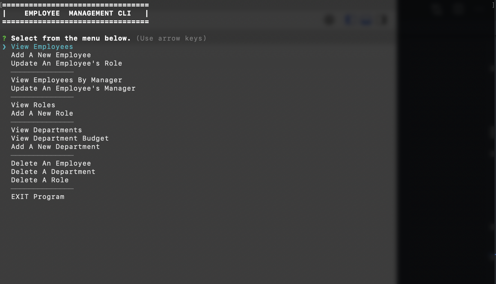
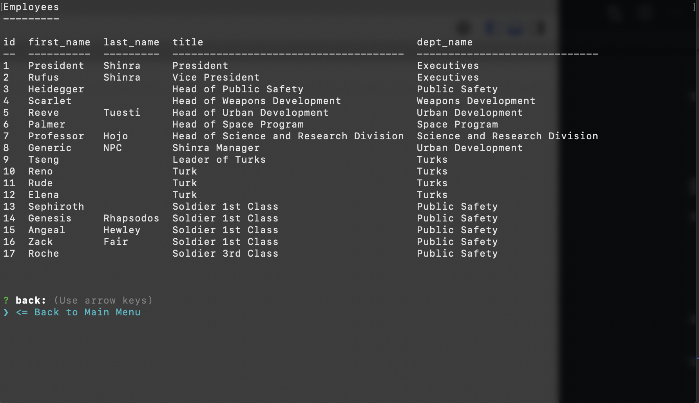

# Employee Management CLI 

## Description

This app is a command line program that allows users to manage employees of a company. Users can view, add, update, and delete employees, their managers, their roles and departments they belong to.

## Table of Contents

* [Installation](#installation)
* [Usage](#usage)
* [License](#license)

## Installation

Clone this repo. Install dependencies.

## Usage

Follow on screen prompts for usage.

```
yarn install
node app.js

```




## License

Licensed under MIT License.

## Questions

Contact [mc4506](mailto:mike4506@gmail.com)